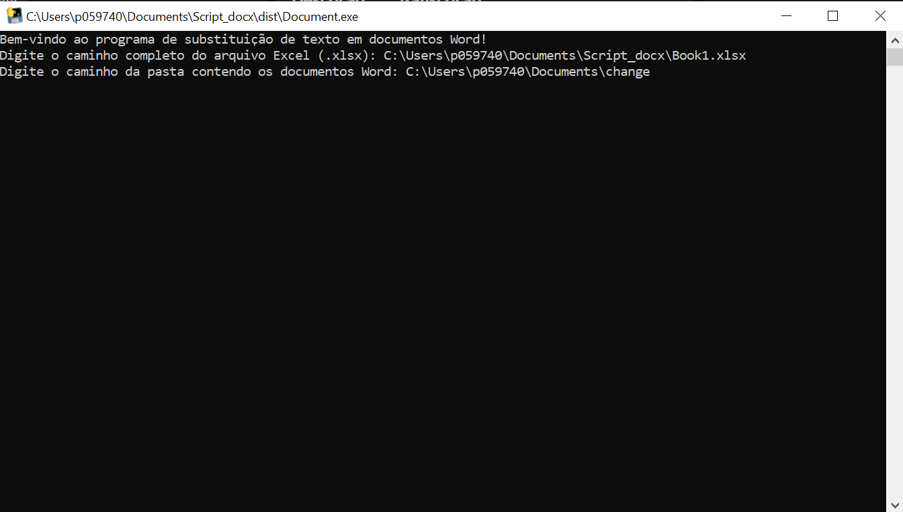

1. O que esse programa faz?

Esse programa permite substituir automaticamente todas as ocorrências de uma palavra dentro de um arquivo do Word por outra palavra ou frase que esteja presente no excel. Por exemplo, se quiser trocar todas as instâncias de "Altice" por "Meo" em um documento.

2. Como usar o programa?
   Fazer duplo clique no executável, de seguida aparecera uma linha de comandos com vários campos para preencher.

1ª Pergunta:
Indicar o caminho do ficheiro de excel (.xlsx);

2ª Pergunta:
Indicar o caminho da pasta onde se encontra o/s ficheiro/s;

